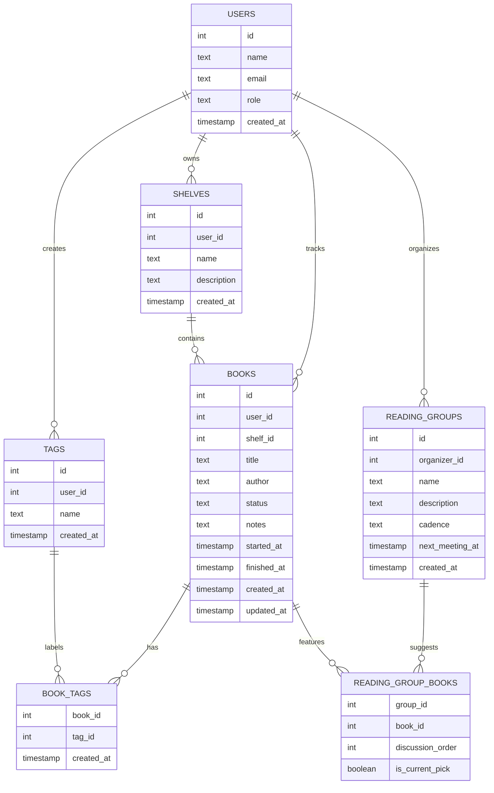

# Entity Relationship Diagram

Reference the Creating an Entity Relationship Diagram final project guide in the course portal for more information about how to complete this deliverable.

## Create the List of Tables

- `users` — stores the reader or club organizer who owns shelves, books, and groups.
- `shelves` — named collections created by a user (for example `Summer 2026` or `Book Club`).
- `books` — the main CRUD entity in the app.
- `tags` — reusable labels a user can apply across multiple books.
- `book_tags` — join table connecting books and tags for the many-to-many relationship.
- `reading_groups` — lightweight shared reading plans created by an organizer.
- `reading_group_books` — join table connecting reading groups and suggested books.

## Add the Entity Relationship Diagram

### `users`

| Column Name | Type | Description |
|-------------|------|-------------|
| id | integer | primary key |
| name | text | display name for the person using the app |
| email | text | unique login/contact field |
| role | text | planned values: `reader` or `organizer` |
| created_at | timestamp | when the user record was created |

### `shelves`

| Column Name | Type | Description |
|-------------|------|-------------|
| id | integer | primary key |
| user_id | integer | foreign key to `users.id` |
| name | text | shelf title |
| description | text | optional context for the shelf |
| created_at | timestamp | when the shelf was created |

### `books`

| Column Name | Type | Description |
|-------------|------|-------------|
| id | integer | primary key |
| user_id | integer | foreign key to `users.id` |
| shelf_id | integer | foreign key to `shelves.id` |
| title | text | book title |
| author | text | author name |
| status | text | planned values: `want_to_read`, `reading`, `finished` |
| notes | text | optional reflection or reminder text |
| started_at | timestamp | when reading began |
| finished_at | timestamp | when reading finished |
| created_at | timestamp | when the book was added |
| updated_at | timestamp | last edit timestamp |

### `tags`

| Column Name | Type | Description |
|-------------|------|-------------|
| id | integer | primary key |
| user_id | integer | foreign key to `users.id` |
| name | text | tag label |
| created_at | timestamp | when the tag was created |

### `book_tags`

| Column Name | Type | Description |
|-------------|------|-------------|
| book_id | integer | foreign key to `books.id` |
| tag_id | integer | foreign key to `tags.id` |
| created_at | timestamp | when the tag was attached to the book |

Composite primary key: (`book_id`, `tag_id`)

### `reading_groups`

| Column Name | Type | Description |
|-------------|------|-------------|
| id | integer | primary key |
| organizer_id | integer | foreign key to `users.id` |
| name | text | group name |
| description | text | short summary of the group |
| cadence | text | meeting frequency such as `monthly` |
| next_meeting_at | timestamp | next planned meeting time |
| created_at | timestamp | when the group was created |

### `reading_group_books`

| Column Name | Type | Description |
|-------------|------|-------------|
| group_id | integer | foreign key to `reading_groups.id` |
| book_id | integer | foreign key to `books.id` |
| discussion_order | integer | optional ordering of suggested books |
| is_current_pick | boolean | highlights the active book for the group |

Composite primary key: (`group_id`, `book_id`)
